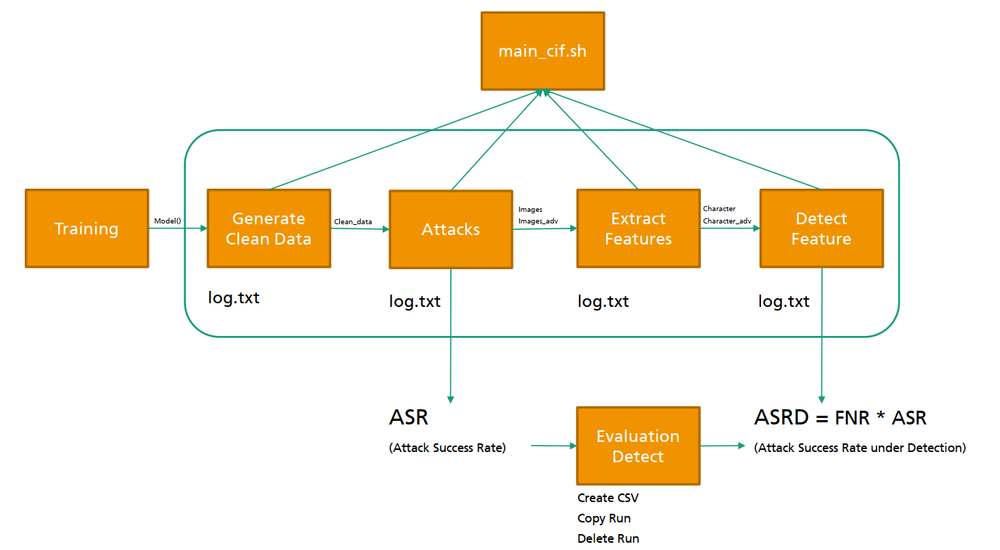

# Adversrial Machine Learning Benchmarks

This code belongs to the papers: 
 * `AAAI 22` [Is RobustBench/AutoAttack a suitable Benchmark for Adversarial Robustness?](https://openreview.net/forum?id=aLB3FaqoMBs)
 * `ICML 21` [Detecting AutoAttack Perturbations in the Frequency Domain](https://openreview.net/forum?id=8uWOTxbwo-Z)


For this framework, please cite:
```
@inproceedings{
lorenz2022is,
title={Is AutoAttack/AutoBench a suitable Benchmark for Adversarial Robustness?},
author={Peter Lorenz and Dominik Strassel and Margret Keuper and Janis Keuper},
booktitle={The AAAI-22 Workshop on Adversarial Machine Learning and Beyond},
year={2022},
url={https://openreview.net/forum?id=aLB3FaqoMBs}
}
```

This repository is an expansion of [SpectralAdversarialDefense](https://github.com/paulaharder/SpectralAdversarialDefense), but has some **new features**:
 * Automatic logging.
 * Several runs can be saved for calculating the variance of the results.
 * new attack method: AutoAttack.
 * datasets: imagenet32, imagenet64, imagenet128, imagenet, celebahq32, celebahq64, and celebahq128.
 * new model: besides VGG-16 we trained a model WideResNet28-10, except for imagenet (used the standard pytorch model.)
 * bash scripts: Automatic starts various combination of input parameters
 * automatic .csv creation from all results.


## Overview



This image shows the pipeline from training a model, generating adversarial examples to defend them. 

1. **Training**: Models are trained. Pre-trained models are provided (WideResNet28-10: cif10, cif100, imagenet32, imagenet64, imagenet128, celebaHQ32, celebaHQ64, celebaHQ128; WideResNet51-2: ImageNet; VGG16: cif10 and cif100)
2. **Generate Clean Data**: Only correctly classfied samples are stored via `torch.save`.
3. **Attacks**: On this clean data severa atttacks can be executed: FGSM, BIM, AutoAttack (Std), PGD, DF and CW. 
4. **Detect Feature**: Detectors try to distinguish between attacked and not-attacked images.
5. **Evaluation Detect**: Is the management script for handling several runs and extract the results to one `.csv` file. 


## Requirements

* GPUs: A100 (40GB), Titan V (12GB) or GTX 1080 (12GB)
* CUDA 11.1
* Python 3.9.5
* PyTorch 1.9.0
* cuDNN 8.0.5_0

Clone the repository 
```sh
$ git clone --recurse-submodules https://github.com/adverML/SpectralDef_Framework
$ cd SpectralDef_Framework
```

and install the requirements
```sh
$ conda create --name cuda--11-1-1--pytorch--1-9-0 -f requirements.yml
$ conda activate cuda--11-1-1--pytorch--1-9-0
```

There are two possiblities: Either use our data set with existing adversarial examples (not provided yet), in this case follow the instructions under 'Download' or generate the examples by yourself, by going threw 'Data generation'. For both possibilities conclude with 'Build a detector'.


### Download

Download the adversarial examples (not provided yet) and their non-adversarial counterparts as well as the trained VGG-16 networks from:
https://www.kaggle.com/j53t3r/weights. Extract the folders for the adversarial examples into /data and the models in the main directory. Afterwards continue with 'Build detector'.

<!-- #### Data download

To get the data directly on your server use wget. For the adversarial examples based on CIFAR-10 use:
```sh
$ wget --load-cookies /tmp/cookies.txt "https://docs.google.com/uc?export=download&confirm=$(wget --quiet --save-cookies /tmp/cookies.txt --keep-session-cookies --no-check-certificate 'https://docs.google.com/uc?export=download&id=1rfSSXNKcquD03lLBXd8IskoZAmDyjzPL' -O- | sed -rn 's/.*confirm=([0-9A-Za-z_]+).*/\1\n/p')&id=1rfSSXNKcquD03lLBXd8IskoZAmDyjzPL" -O cif10_adversarial_images.zip && rm -rf /tmp/cookies.txt
```

then unzip
```sh
$ unzip -o cif10_adversarial_images.zip -d data/
$ rm cif10_adversarial_images.zip 
```

For adversarial examples based on CIFAR-100 use:
```sh
$ wget --load-cookies /tmp/cookies.txt "https://docs.google.com/uc?export=download&confirm=$(wget --quiet --save-cookies /tmp/cookies.txt --keep-session-cookies --no-check-certificate 'https://docs.google.com/uc?export=download&id=1NeWUvU63F04aO8k285PJNnfrB21RoI91' -O- | sed -rn 's/.*confirm=([0-9A-Za-z_]+).*/\1\n/p')&id=1NeWUvU63F04aO8k285PJNnfrB21RoI91" -O cif100_adversarial_images.zip && rm -rf /tmp/cookies.txt
``` -->

#### Datasets download

These datasets are supported:
 * cifar10 
 * cifar100
 * [ImageNet32x32](https://www.kaggle.com/j53t3r/imagenet32x32)
 * [ImageNet64x64](https://www.kaggle.com/j53t3r/imagenet64x64)
 * [ImageNet128x128](https://www.kaggle.com/j53t3r/imagenet128x128)
 * [ImageNet 2012](https://image-net.org/challenges/LSVRC/2012/2012-downloads.php)
 * [CelebaHQ 32x32 64x64 128x128 256x256](https://www.kaggle.com/j53t3r/celebahq)

  <!-- * [ImageNet240x240 t.b.a.](https://www.kaggle.com/j53t3r/datasets?scroll=true) -->


Download and copy the weights into `data/datasets/`. In case of troubles, adapt the paths in `conf/global_settings.py`.


#### Model download

To get the weights for all networks for CIFAR-10 and CIFAR-100, ImageNet and CelebaHQ download: 

1. [Kaggle Download Weights](https://www.kaggle.com/j53t3r/weights)
2. Copy the weights into `data/weights/`.

In case of troubles, adapt the paths in `conf/global_settings.py`. You are welcome to create an issue on Github.

### Data generation

Train the VGG16 on CIFAR-10:
```sh
$ python train_cif10.py
```

or on CIFAR-100
```sh
$ python train_cif100.py
```

<!-- Copy the pth-files from the checkpoint directory to /models/vgg_cif10.pth or /models/vgg_cif100.pth. In detail: For cif10 go to the folder ./checkpoints; copy the file ckpt.pth to the folder ./models and rename it vgg_cif10.pth. For cif100: Go to the folder ./checkpoints/vgg16; select a folder; copy a file *.pth to the folder ./models and rename it vgg_cif100.pth. -->


The following skript will download the CIFAR-10/100 dataset and extract the CIFAR10/100 (imagenet32, imagenet64, imagenet128, celebAHQ32, ...) images, which are correctly classified by the network by running. Use --net cif10 for CIFAR-10 and --net cif100 for CIFAR-100
```sh
$ # python generate_clean_data.py -h  // for help
$ python generate_clean_data.py --net cif10
```

Then generate the adversarial examples, argument can be fgsm (Fast Gradient Sign Method), bim (Basic Iterative Method), pgd (Projected Gradient Descent), [new] std (AutoAttack Standard), df (Deepfool), cw (Carlini and Wagner), :
```sh
$ # python attack.py -h  // for help
$ python attack.py --attack fgsm
```

### Build detector

First extract the necessary characteristics to train a detector, choose a detector out of InputMFS (BlackBox - BB), InputPFS, LayerMFS (WhiteBox - WB), LayerPFS, LID, Mahalanobis adn an attack argument as before: 

```sh
$ # python extract_characteristics.py -h  // for help
$ python extract_characteristics.py --attack fgsm --detector InputMFS
```


Then, train a classifier on the characteristics for a specific attack and detector:
```sh
$ python detect_adversarials.py --attack fgsm --detector InputMFS
```

### [new] Create csv file

At the end of the file `evaluation_detection.py` different possibilities are shown:

```sh
$ python evaluation_detection.py 
```

Note that: `layers=False` for evaluating the detectors after the the right layers are selected. 


## Other repositories used
* For training the VGG-16 on CIFAR-10 we used:
https://github.com/kuangliu/pytorch-cifar.
* For training on CIFAR-100:
https://github.com/weiaicunzai/pytorch-cifar100.
* For training on imagenet32 (64 or 128) and celebaHQ32 (64 or 128)
https://github.com/bearpaw/pytorch-classification.
* For generating the adversarial examples we used the toolbox foolbox:
https://github.com/bethgelab/foolbox.
* For the LID detector we used:
https://github.com/xingjunm/lid_adversarial_subspace_detection.
* For the Mahalanobis detector we used:
https://github.com/pokaxpoka/deep_Mahalanobis_detector.
* For the AutoAttack detector we used:
https://github.com/adverML/auto-attack/tree/forspectraldefense. This one is already added as: `git submodule add -b forspectraldefense  git@github.com:adverML/auto-attack.git submodules/autoattack`
* Other detectors:
https://github.com/jayaram-r/adversarial-detection.
